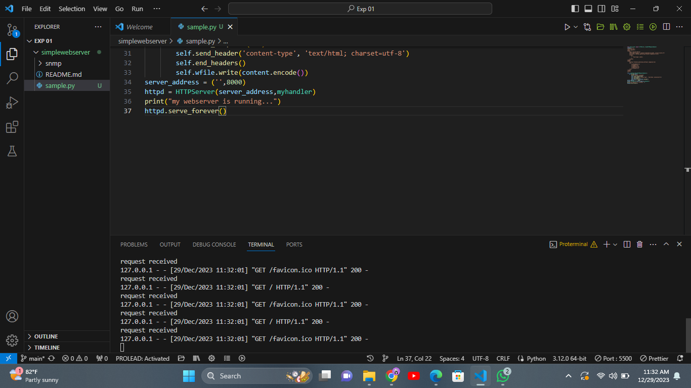
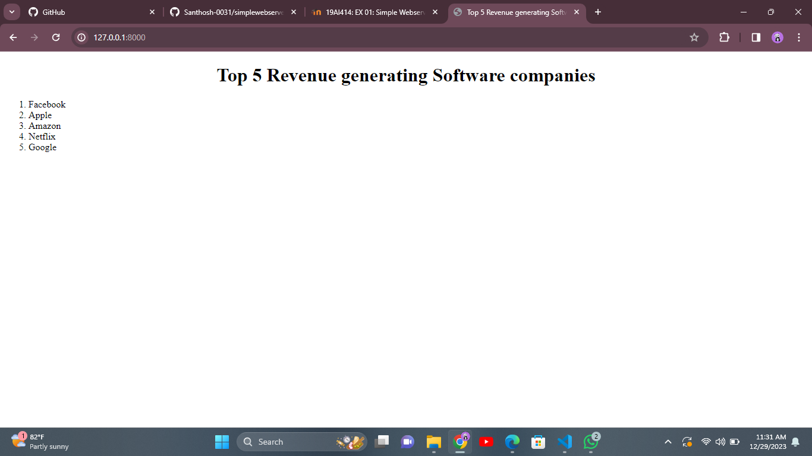

# EX01 Developing a Simple Webserver
## Name: Santhosh Kumar R
## Register no: 212223100051

## AIM:
To develop a simple webserver to serve html pages.

## DESIGN STEPS:
### Step 1: 
HTML content creation.

### Step 2:
Design of webserver workflow.

### Step 3:
Implementation using Python code.

### Step 4:
Serving the HTML pages.

### Step 5:
Testing the webserver.

## PROGRAM:
```
<!DOCTYPE html>
<html lang="en">
<head>
    <meta charset="UTF-8">
    <meta name="viewport" content="width=device-width, initial-scale=1.0">
    <title>Top 5 Revenue generating Software companies</title>
    <style>
        h1 {
            text-align: center;
        }
    </style>
</head>
<body>
    <h1>Top 5 Revenue generating Software companies</h1>
    <ol>
        <li>Facebook</li>
        <li>Apple</li>
        <li>Amazon</li>
        <li>Netflix</li>
        <li>Google</li>
    </ol>
</body>
</html>
```

## OUTPUT:


## RESULT:
The program for implementing simple webserver is executed successfully.
